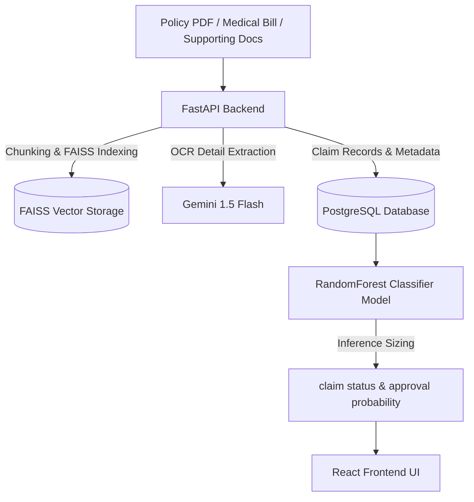

# AI Insurance Copilot 🛡️💼

An enterprise-grade, intelligent claims analysis and policy RAG (Retrieval-Augmented Generation) copilot. The application helps users verify policy coverages, extract medical bill metadata using OCR, predict claim approval odds using a Scikit-Learn machine learning classifier, and consult an AI policy assistant.

---

## 🚀 Key Features

*   **Smart Policy RAG Assistant**: Interactive chatbot equipped with a FAISS vector database and Gemini LLM. Users can ask questions about waiting periods, coverage limits, or hospital networks, and get answers grounded strictly in their uploaded policy PDF.
*   **OCR Invoice Metadata Extraction**: Performs advanced text extraction on medical bills to pull the hospital name, diagnosis details, billing amount, and date of treatment.
*   **ML Claim Approval Classifier**: Runs a trained `RandomForestClassifier` to estimate claim approval probability based on coverage parameters, waiting periods, hospital networks, claim limits, and supporting document uploads.
*   **Dynamic Checklist & Warnings**: Checks document integrity in real-time, warning the user before replacing active policies or bills to protect index consistency.
*   **Clean Session Lifecycle**: Resetting or replacing a policy clears database records, local directory uploads, and FAISS vectors completely to establish a fresh claim state.

---

## 🛠️ Tech Stack

*   **Frontend**: React (Vite), Tailwind CSS (Aesthetics-rich typography, custom glow effects, card layouts, status badges).
*   **Backend**: FastAPI (Python 3.12), Uvicorn, SQLAlchemy.
*   **Database**: PostgreSQL.
*   **AI/ML & Vector Search**: LangChain, FAISS, Google Gemini (Gemini 1.5 Flash), Scikit-Learn (Random Forest).

---

## 📋 System Architecture



---

## ⚙️ Getting Started & Setup

### 1. Database Configuration
Create a PostgreSQL database named `insurance_copilot`:
```sql
CREATE DATABASE insurance_copilot;
```

### 2. Backend Installation & Start
Navigate to the project root directory:
```bash
# Set environment variables
$env:GOOGLE_API_KEY="your-gemini-api-key"
$env:DATABASE_URL="postgresql://postgres@localhost:5432/insurance_copilot"

# Install requirements
pip install -r requirements.txt

# Run migrations and setup tables
python backend/create_db.py

# Train the initial ML claim model
python backend/train_model.py

# Start the FastAPI server
python -m uvicorn backend.app:app --host 127.0.0.1 --port 8000
```

### 3. Frontend Installation & Start
Navigate to the `frontend/` directory:
```bash
cd frontend

# Install node dependencies
npm install

# Start Vite developer server
npm run dev
```
Open [http://localhost:5173](http://localhost:5173) in your browser.

---

## 🔒 Session Integrity & Reset Lifecycle
*   **Upload Policy**: Clears all previous claims database records, OCR bills metadata, local directory uploads, and rebuilds the FAISS vector index fresh.
*   **Upload Medical Bill**: Resets the current claim analysis and clears local claims folder uploads to request fresh supporting document verifications (Prescription, Aadhaar, bank passbook).
*   **Upload Supporting Docs**: Supporting files (Prescription, Aadhaar, Bank Passbook) are processed directly into the active claims session folder without overwriting existing bill details.
